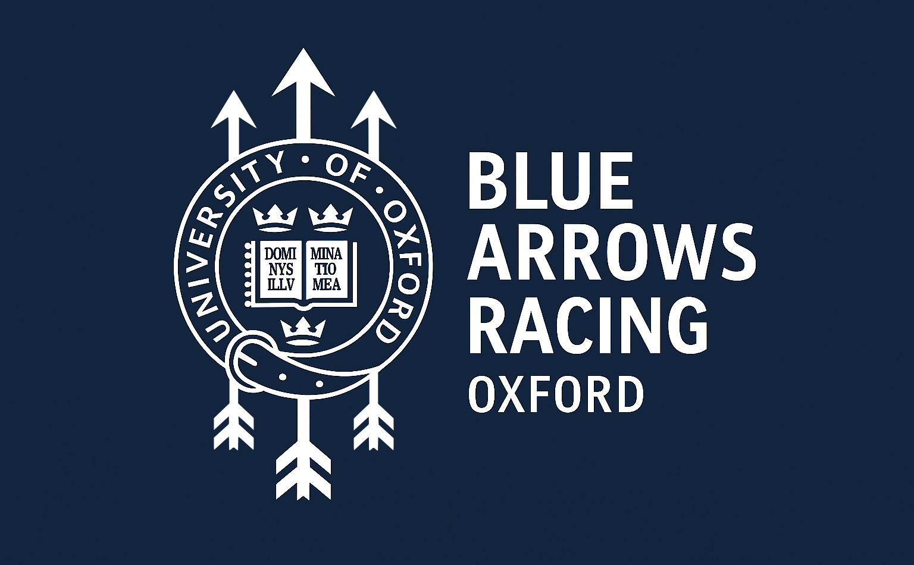
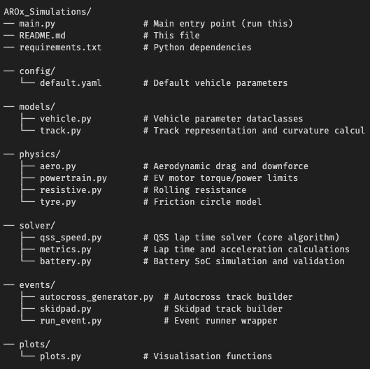
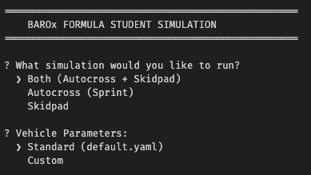
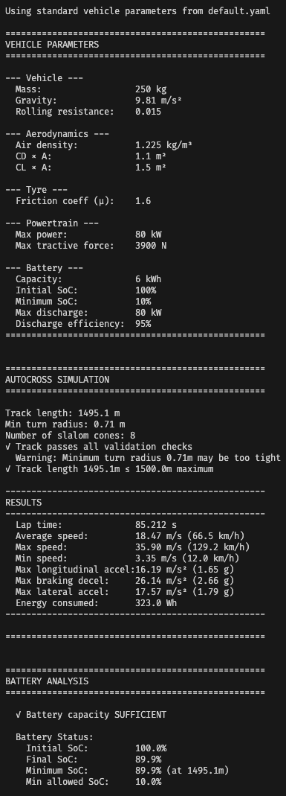

<div align="center">

# BAROx Formula Student Lap Time Simulator

**Blue Arrows Racing Oxford (BAROx)**



University of Oxford 
 
MEng Engineering Science

3rd Year Design Project  

*Author: Laith Shareiyat*
</div>

---
<br/>

## Overview

A **Quasi-Steady-State (QSS) point-mass lap time simulator** designed specifically for Formula Student electric vehicles. This tool simulates the **Autocross** and **Skidpad** events, calculating lap times, energy consumption, and battery state-of-charge throughout each run.

### Key Features

- 🏎️ **QSS Lap Time Simulation** - Forward/backward pass algorithm with friction circle constraint
- 🔋 **Battery Tracking** - State-of-charge monitoring throughout the lap (no regenerative braking)
- 📊 **Visualisation** - Track layouts, speed profiles, and battery state plots
- ⚙️ **Configurable Vehicle** - YAML-based configuration or interactive input
- ✅ **Track Validation** - Checks against Formula Student rules

### Current Limitations (MVP)

- No tyre load sensitivity modelling
- No roll dynamics
- No torque vectoring
- Point-mass vehicle model (no yaw dynamics)

---
## Project Structure
Below is a simple representation of the modular code structure:


## Installation

### Prerequisites

- Python 3.10 or higher
- pip (Python package manager)

### Setup

1. **Clone the repository:**
   ```bash
   git clone https://github.com/LaithShareiyat/BAROx_Simulations.git
   cd BAROx_Simulations
   ```

2. **Create a virtual environment:**
    ```bash
    python -m venv venv

    # On macOS/Linux:
    source venv/bin/activate

    # On Windows:
    venv\Scripts\activate
   ```

3. **Install dependencies**
    ```bash
    pip install -r requirements.txt
   ```

## Quick Start

### Running the simulation

To run the simulator, go to the root directory and run: 
```bash
python main.py
```
<br/>
You will then be presented with the following interactive menu in your terminal:



Simulation Options
| Option | Description |
|----------|----------|
| Both    | Runs the Autocross follwed by Skidpad simulation   |
| Autocross    | Sprint event simulation   |
| Skidpad    | Skidpad event simulation   |

<br/>

Vehicle Parameters
| Option | Description |
|----------|----------|
| Standard    | Uses parameters from config/default.yaml   |
| Custom    | Interactive prompts to enter custom values   |

### Output
The simulator will output results in the terminal such as the following: 


<br/>
<br/>
The simulator also generates the following plots: 

- Track Layout with Speed Map
- Battery State Plot
  - State of Charge (SOC) vs Distance
  - Power vs Distance
  - Cumulative Energy vs Distance
- SOC Map on Track

## Future Developments
I am working on the following: 

- Simple GUI - In progress
- Multi config optimisation - In progress
- Torque Vectoring - In progress
- Better Tyre modelling (contact patch modelling)
- Suspension modelling
- Roll dynamics and weight transfer