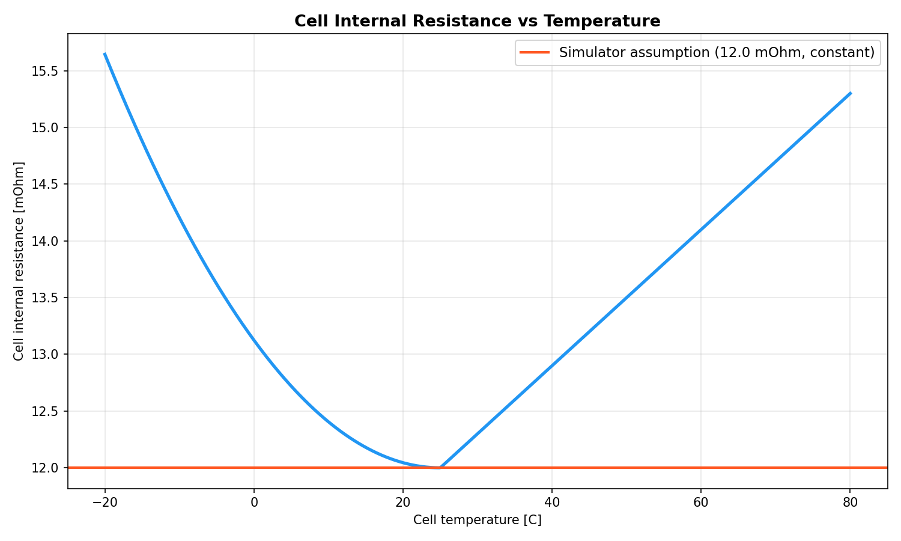
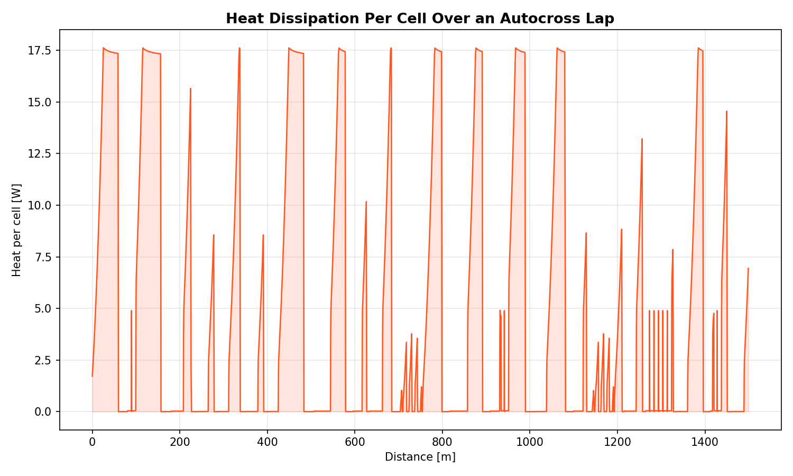
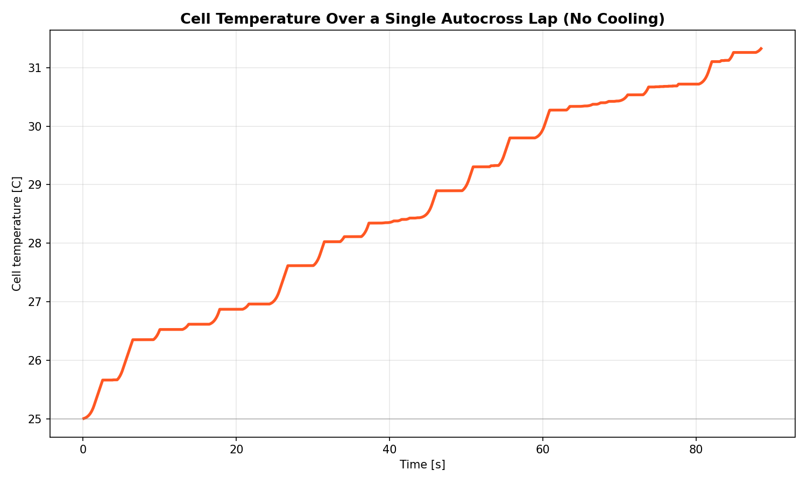
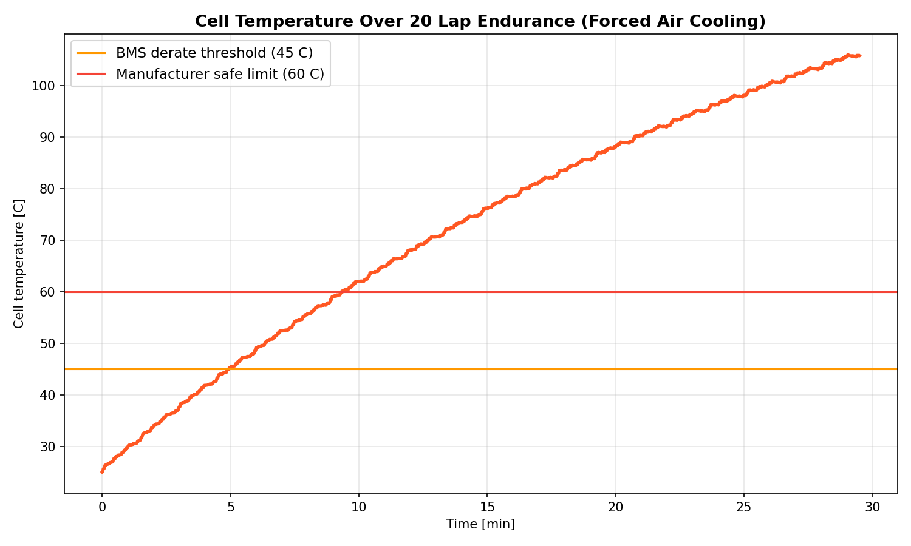
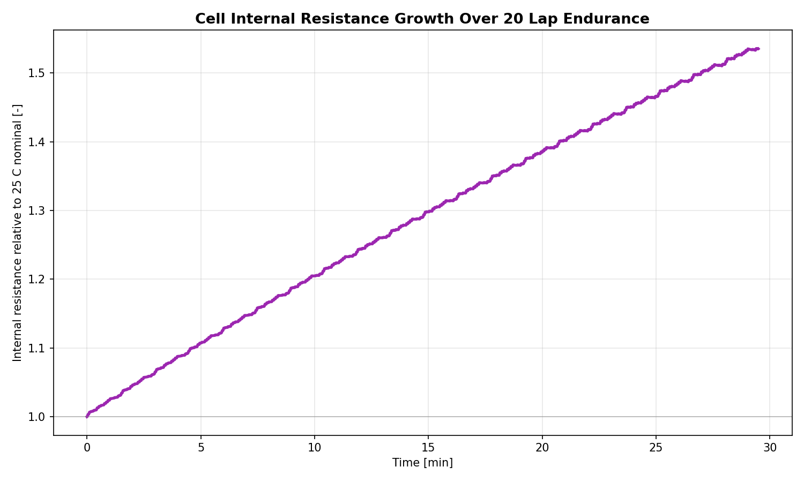

# Battery Thermal Model Assumption Analysis

## Context

The BAROx lap time simulator does not track battery temperature. It assumes that cell internal resistance, discharge current limits, and available capacity remain constant regardless of how much heat the pack generates during operation. This analysis uses five figures produced by `battery_thermal_assumption.py` to determine whether this assumption is valid across the events the simulator is used for.

The pack under analysis is a 142S5P configuration using Samsung 25R class 18650 cells (2600 mAh, 3.6 V nominal, 12 mOhm internal resistance, 45 g per cell, 710 cells total).

---

## Figure 1: Cell Internal Resistance vs Temperature

Internal resistance is the source of all resistive heating in the pack. When current flows through the cell, the voltage drop across the internal resistance (V = I x R_int) represents energy that is converted to heat rather than delivered to the motor.

The measured characteristic of 18650 NMC cells shows a U-shaped relationship between resistance and temperature. At 25 C, the cell sits at its minimum resistance of 12 mOhm. Below this temperature, the electrolyte viscosity increases and ion transport slows, raising resistance. At -10 C the resistance is 14.2 mOhm (18% above nominal). Above 25 C, accelerated side reactions and growth of the solid-electrolyte interface layer gradually increase impedance. By 60 C, resistance has returned to 14.1 mOhm (18% above nominal).

The simulator uses a constant 12 mOhm at all times. This is only correct when the cell is near 25 C. Any departure from this temperature means the simulator underestimates resistive losses and heat generation.

**Implication**: The constant resistance assumption introduces an error that grows with temperature deviation. In cold conditions (winter testing, early morning), resistance is underestimated from the start. In sustained high-power operation, the cells heat up and resistance increases, but the simulator does not account for this.

---

## Figure 2: Heat Dissipation Per Cell Over an Autocross Lap

This figure shows the instantaneous I²R heat generated inside each cell as the car completes a single autocross lap (88.5 s). The trace is highly transient: each spike corresponds to a corner exit where the driver applies full throttle and current surges through the pack. The tallest spikes reach 17.6 W per cell, corresponding to near-maximum discharge current. Between corners, during braking and coasting, current is zero and no resistive heat is generated.

The total heat deposited in each cell over the lap is 285 J, with a mean dissipation of 4.0 W during driving segments. This bursty profile is characteristic of autocross and sprint events where the car alternates rapidly between full power and zero power.

**Implication**: The heating profile is not steady-state. The cells experience repeated thermal pulses. For a single short event, the total energy deposited is modest. However, the peak instantaneous heating rate (17.6 W in a 45 g cell) is significant and would produce localised hot spots if sustained.

---

## Figure 3: Cell Temperature Over a Single Autocross Lap

This figure plots the cell temperature over the duration of a single autocross lap assuming zero cooling (adiabatic, worst case). The staircase shape directly reflects the bursty power profile: temperature rises during acceleration zones and holds steady during braking. Over the full 88.5 s lap, the cell temperature rises from 25.0 C to 31.3 C, a total increase of 6.3 C.

A temperature of 31 C is well within the optimal operating window of 20 to 40 C. At this temperature, cell internal resistance has increased by less than 1% from its 25 C value (from Figure 1), discharge current capability is unaffected, and available capacity is unchanged.

**Implication**: For a single autocross lap, the no-thermal-tracking assumption is valid. The temperature rise is small enough that cell performance is indistinguishable from the constant-temperature model. The same conclusion applies to other short events such as skidpad and acceleration, which involve less total energy than autocross.

---

## Figure 4: Cell Temperature Over 20 Lap Endurance (Forced Air Cooling)

This figure extends the analysis to a 20-lap endurance event (approximately 30 minutes), now including forced air cooling at h = 35 W/(m²K) over an estimated 0.5 m² of pack surface area. Despite active cooling, the temperature rises almost linearly throughout the event because the cooling power (proportional to the temperature difference between cell and ambient) is small compared to the sustained I²R heat input.

Two physical thresholds are marked:

- **BMS derate threshold (45 C)**: Reached at 4.9 minutes (lap 4). At this point a real battery management system would begin reducing the maximum allowed discharge current to protect cell longevity. The car would have less power available and lap times would increase.

- **Manufacturer safe limit (60 C)**: Reached at 9.4 minutes (lap 7). Beyond this temperature, the rate of irreversible capacity degradation accelerates significantly. Continued operation above this limit shortens pack life and risks safety events. A well-designed BMS would impose hard current limits or shut down the pack.

By the end of the 30-minute event, the model predicts a cell temperature of 106 C. In practice, BMS intervention would prevent this from occurring, but the simulator has no mechanism to represent this power derating. It continues to compute lap times as if the full 80 kW were available for the entire event.

**Implication**: For endurance events, the no-thermal-tracking assumption is not valid. The simulator overestimates available power from approximately lap 4 onwards. The magnitude of this error grows with each subsequent lap as the real car is increasingly thermally limited while the simulated car is not. Predicted endurance lap times from the second quarter of the event onwards are optimistic.

---

## Figure 5: Cell Internal Resistance Growth Over 20 Lap Endurance

This figure shows the consequence of the temperature rise from Figure 4 fed back through the resistance-temperature relationship from Figure 1. As the cells heat up, their internal resistance increases. Higher resistance generates more I²R heat per amp of current. This additional heat raises the temperature further, which increases resistance again. This is a positive feedback loop.

Over the 20-lap endurance, cell internal resistance grows from 12.0 mOhm to 18.4 mOhm, an increase of 54%. This has two physical consequences:

1. **Increased energy waste**: 54% more resistance means 54% more power is dissipated as heat for the same current. The energy that reaches the motor is correspondingly reduced. The simulator does not account for this additional energy loss, so it underestimates total energy consumption during long events.

2. **Accelerated heating**: The higher resistance generates more heat, which accelerates the temperature rise beyond what a constant-resistance model predicts. The actual time to reach the BMS derate threshold would be shorter than predicted by a fixed-resistance thermal model.

**Implication**: Ignoring the resistance-temperature feedback means the simulator underestimates both energy consumption and the rate of thermal degradation during endurance. The two errors compound: the real car uses more energy than predicted and has less power available than predicted.

---

## Conclusion

The validity of the no-thermal-tracking assumption depends entirely on event duration:

| Event | Duration | Temp Rise | Assumption Valid? |
|-------|----------|-----------|-------------------|
| Acceleration | ~5 s | < 1 C | Yes |
| Skidpad | ~10 s | ~1 C | Yes |
| Autocross | ~90 s | ~6 C | Yes |
| Endurance | ~30 min | > 80 C | No |

For short events (acceleration, skidpad, autocross), the cells remain within the optimal temperature window and the assumption introduces negligible error. Cell resistance, current limits, and capacity are effectively unchanged from their 25 C values.

For endurance, the assumption breaks down by lap 4 (approximately 5 minutes in). From that point, a real BMS would derate discharge current, reducing available power and increasing lap times. The simulator does not capture this behaviour, meaning it overestimates car performance in the second half of the endurance event. Additionally, the positive feedback between temperature and internal resistance means the simulator underestimates cumulative energy consumption, which could lead to incorrect predictions about whether the pack has sufficient capacity to complete the event.

If the simulator is to be used for endurance strategy (energy management, pace planning, pit timing), a thermal model with BMS derating logic is needed. For all other events in their current form, the no-thermal-tracking assumption is acceptable.
